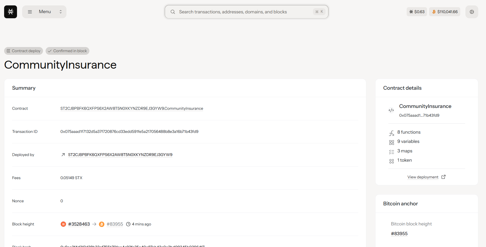

# Community Insurance against Cyber Attacks with Threat Intelligence Sharing

## 1. Project Title
**Community Insurance against Cyber Attacks with Threat Intelligence Sharing**

## 2. Project Description
This project is a community-driven Web3 insurance pool designed to protect users against cyber attacks such as phishing, wallet hacks, and smart contract exploits. Users can stake STX tokens as premiums into a shared insurance pool and request claims in case of an incident. Additionally, the project will support threat intelligence sharing where community members can report malicious activities for collective protection.

The current MVP includes:
- **Contribution of funds into an insurance pool**: Members can stake STX tokens with a minimum contribution requirement
- **Claim request mechanism**: Affected members can submit detailed claim requests with incident descriptions
- **Event emission system**: All activities are logged for transparency and off-chain processing
- **Member tracking**: Complete history of contributions and claims per member
- **Validation mechanisms**: Claims are validated against member contributions to prevent abuse

### Key Features:
- Minimum contribution requirement (1 STX) to ensure serious participation
- Claim amount validation (maximum 10x member's contribution) to prevent fraud
- Comprehensive event logging for transparency
- Member contribution and claim history tracking
- Decentralized and transparent claim submission process

## 3. Project Vision
Our vision is to create a transparent, decentralized, and community-powered insurance platform. By combining insurance staking with threat intelligence reporting, we aim to protect users and organizations from cyber threats, while promoting collective security in the blockchain ecosystem. 

We envision a future where:
- Community members actively protect each other against cyber threats
- Threat intelligence is shared transparently and rewarded
- Claims are processed fairly through decentralized governance
- The insurance pool grows stronger with each member's participation
- Cyber security becomes a collective responsibility rather than an individual burden

## 4. Future Scope
### Phase 1 - Governance & Automation (Next 6 months)
- **DAO Governance**: Members will vote on claim approvals and policy decisions
- **Automated Claim Settlement**: Pool balance will automatically pay approved claims
- **Multi-signature claim approval**: Require multiple community validators

### Phase 2 - Intelligence & Rewards (6-12 months)
- **Threat Intelligence Sharing**: On-chain storage of malicious wallet addresses, phishing URLs, and related data
- **Rewards Mechanism**: Reporters of valid threats will receive token incentives
- **Risk Assessment Algorithm**: Dynamic premium calculation based on user behavior and threat landscape

### Phase 3 - Advanced Features (12+ months)
- **IPFS Integration**: Evidence (screenshots, logs) will be stored in decentralized storage
- **Cross-chain Protection**: Extend insurance coverage across multiple blockchain networks
- **AI-powered Threat Detection**: Integrate machine learning for proactive threat identification
- **Insurance NFTs**: Tokenize insurance policies as tradeable NFTs
- **Reinsurance Mechanisms**: Partner with traditional insurance companies for larger coverage

### Phase 4 - Ecosystem Expansion
- **API for DApps**: Allow other applications to integrate insurance coverage
- **Mobile App**: User-friendly mobile interface for claim submissions and threat reporting
- **Educational Platform**: Cyber security awareness and training modules
- **Enterprise Solutions**: Tailored insurance products for businesses and protocols

## 5. Contract Address Details
Contract ID:ST2CJBPBFK6QXFPS6X2AW8T5N0XKYNZDR9EJ3GYW9.CommunityInsurance

- **Network**: Stacks Mainnet/Testnet
- **Contract Address**: 
- **Explorer Link**: 
- **Contract Name**: 
- **Deployment Date**:

### Contract Functions:
- `contribute-to-pool`: Stake STX tokens into the insurance pool
- `request-claim`: Submit a claim for cyber attack incidents
- `get-pool-balance`: View total pool balance
- `get-member-contribution`: Check individual member contributions
- `get-claim-details`: View specific claim information
- `get-contract-stats`: Get overall contract statistics
